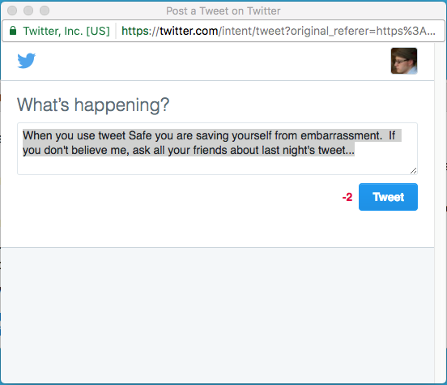

#tweet Safe 
*by Ari Robbins*

**Summary**

An application that provides sentiment analysis to your tweets, preventing embarrassing or ill-advised tweets.

**Description**

Tweet Safe is an app that allows you to "check yourself before you wreck yourself" when it comes to tweets. Just type your text into the box and tweet Safe will analyze the sentiment of your tweet and advise on whether or not you should tweet. It will also let you tweet right from the application.

The technologies used to create tweet Safe are as follows:
* HTML
* CSS
* Flexbox
* JavaScript
* jQuery
* jQuery UI
* MeaningCloud API

**Home Page**

When you navigate to tweet Safe (https://arirobbins.github.io/tweet_Safe/) you will be welcomed by the following screen:

**tweet box**

Once you click on the tweet Safe logo, you are taken to a simple form where you can begin to tweet.  When you are done, the counter will let you know if you have input to much text (more than 140 characters).  Next click evaluate, and tweet Safe will start to do its job!

**Analysis**

When the analysis is complete, a modal dialog will appear which will give you a break down of the sentiment of each of the sentences you types as well as the overall sentiment of the tweet.  From here you can decide whether to fix your tweet or to send it.

**Twitter**

Finally, if you decide to send your tweet, a twitter pop-up will open up and allow you to review your tweet once more before tweeting.

And that's tweet Safe.  Happy tweeting, and don't forget to **tweet Safe!**

